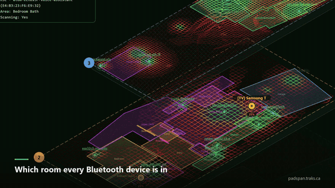
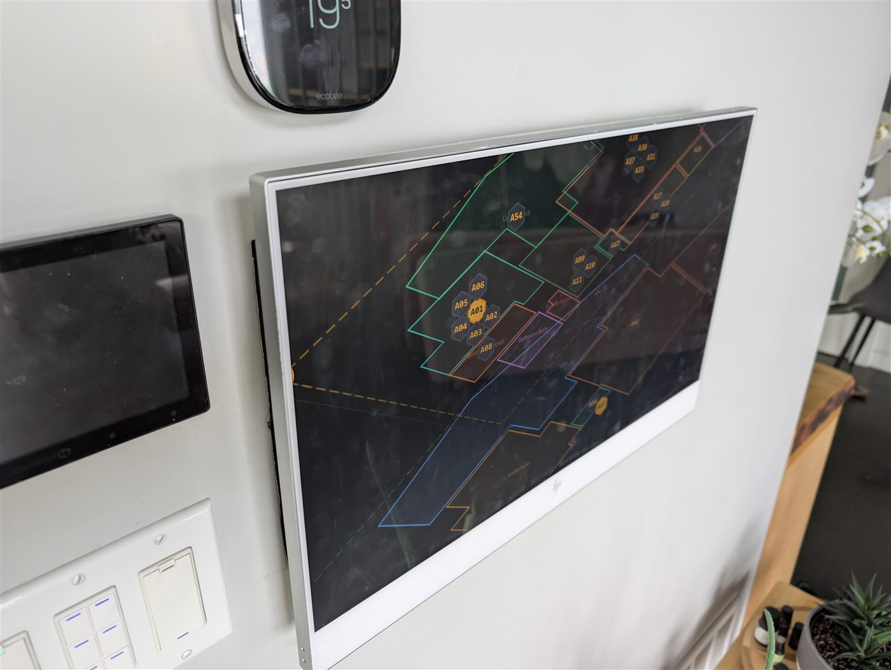

# PadSpan™ HA

### The most comprehensive BLE room-presence system for Home Assistant

PadSpan™ HA goes far beyond "home or away." It tells you **which room** every Bluetooth device is in — updated every 5 seconds — with interactive floor plans, 3D multi-floor visualizations, a full calibration system, and 19 dedicated views. No other Home Assistant BLE integration comes close.

🌐 **Website: [padspan.traks.ca](https://padspan.traks.ca)**

20-second tour. The same shots at full size are in the table below, and the full walkthrough video is on [padspan.traks.ca](https://padspan.traks.ca/#demo).

---

## Why PadSpan?

Most BLE presence integrations give you a config flow and a sensor. PadSpan gives you a **complete tracking workstation** — floor plan editor, room boundary polygons, 3D isometric maps, walk-around calibration, follow mode with email alerts, a training hub, and a full sample/demo mode so you can explore every feature before plugging in hardware.

It works with your existing BLE scanners. HA Bluetooth proxies and Bermuda proxies are picked up directly; ESPresense nodes come in over MQTT, which you switch on in **Manage → ESPresense MQTT** and which needs HA's MQTT integration configured. No custom firmware. No cloud dependency. Everything runs locally.

---

## Screenshots

### Running on the wall

Not a mockup — this is PadSpan on a wall panel in daily use, next to the
thermostat and light switches.

---

| 3D Multi-Floor Tracking | 3D Heatmap + Signal Overlay |
|:-:|:-:|
|  |  |

| Maps Library | Scanner-to-Device Graph |
|:-:|:-:|
|  |  |

| Traceback Playback + Distance Traveled | Beacon Tune Calibration |
|:-:|:-:|
|  |  |

| Pure Live — Immersive Dashboard | Traceback — Movement Playback |
|:-:|:-:|
|  |  |

| Sandbox Developer Tools | Floor Plan Editor |
|:-:|:-:|
|  |  |

---

## Feature Highlights

### Presence Tracking
- Room-level BLE device tracking (5-second refresh)
- **Follow mode** — animated room map + movement timeline for any tracked device
- Multi-device simultaneous tracking with per-device email alerts (60 s rate limit)
- Kalman-filtered RSSI smoothing (replaces simple moving averages)
- Home/away detection with HA binary sensor entities
- **Phone & watch tracking** — guided setup wizard with [irk-capture](https://github.com/DerekSeaman/irk-capture) integration, HA Companion App iBeacon for Android, and IRK resolution for Apple devices
- Private BLE address resolution (iBeacon UUID + IRK support)
- **Occupancy estimation** — people in the building, never devices: HA person entities (one per phone), unclaimed phones and watches recognised on the air by their rotating addresses and clustered by RSSI co-location, and occupancy/motion sensors by room; tagged things are listed, not counted

### Device Identity
- **Stable device identity (padspan_id)** — every physical device gets an immutable ID that survives MAC rotation, iBeacon UUID changes, and firmware updates
- O(1) identity resolution from any volatile key (MAC, iBeacon, canonical_id)
- Automatic migration from older object/tag systems
- Interactive device registry: merge duplicates, add identities, relabel, delete

### Floor Plans & Maps
- Upload architectural floor plans (PNG/JPG) with auto-scaling
- **Two-point measure tool** for precise real-world scale calibration with aspect ratio validation
- Draw room boundary polygons directly over blueprints
- Multi-floor **3D isometric visualization** with live object positions
- **2D flat map mode** with zoom/pan and toggle filters (scanners, tagged, unknown, rooms)
- Drag-and-place scanner markers with 3-digit radio IDs
- Auto-detect stale or missing radios on your map
- Master map alignment for multi-floor coordinate consistency

### Calibration
- Walk-around fingerprint collection with a **standalone phone-friendly panel**
- k-NN fingerprint matching + OLS path-loss model fitting per scanner
- Coverage heatmap with guided "walk here next" target suggestions
- Leave-one-out cross-validation for model quality scoring
- 3D isometric tune view with draggable receiver markers

### Multi-Floor Intelligence
- **Floor-transition learning** — adaptive dwell-based velocity gate prevents phantom floor changes
- Learned cross-floor RSSI attenuation
- Outdoor penalties (0.30× Gaussian damping) for exterior boundary rooms

### Phone & Watch Tracking

Tracking phones is the hardest problem in BLE presence — they rotate their Bluetooth address every ~15 minutes specifically to prevent tracking. PadSpan offers multiple paths depending on your device:

| Device | Easiest Method | What You Need |
|--------|---------------|---------------|
| **Android phone** | HA Companion App iBeacon | Install app, enable BLE Transmitter. Done. |
| **iPhone / iPad** | IRK via [irk-capture](https://github.com/DerekSeaman/irk-capture) | Spare ESP32, flash irk-capture, pair once, paste IRK |
| **Apple Watch** | IRK via irk-capture | Same as iPhone — pair watch to irk-capture ESP32 |
| **Tile / Chipolo** | Automatic (iBeacon) | Stable UUID — just works, tag once and the name sticks across rotations |
| **AirTag** | Probabilistic (experimental) | Enable **Apple Device Classification** + **MAC Rotation Bridging** in Settings → Features. AirTags rotate both MAC and Find My key every ~15 min and expose no stable identifier, so bridging links rotations by advertisement pattern — works while in continuous range, may mis-link in crowded RF environments |
| **SmartTag** (Samsung) | Probabilistic | Same as AirTag — no stable identifier in the air, relies on MAC Rotation Bridging |
| **AirPods** | Apple auto-classification | Detected and labeled automatically when feature enabled (display only — does not solve identity) |

The **Phone Setup Wizard** (experimental) guides you through each path with step-by-step instructions. If you have an irk-capture ESP32 on your network, PadSpan auto-detects captured IRKs — no manual hex pasting.

For devices where you can't get an IRK, the experimental **MAC Rotation Bridging** feature matches advertisement patterns across address rotations to maintain tracking continuity.

> **Acknowledgement:** The IRK extraction workflow is built on [Derek Seaman's irk-capture](https://github.com/DerekSeaman/irk-capture) — an ingenious ESP32 tool that emulates BLE peripherals to extract Identity Resolving Keys during pairing. It's what makes practical phone tracking in Home Assistant possible without rooting devices or owning a Mac.

### Scanner Hardware & Management
- **Tested with 20+ ESP32 boards** — the antenna matters more than the chip. Boards with full-size external antennas consistently outperform chip/PCB antennas for room-level accuracy
- Top picks: ESP32-S3 with Ethernet + antenna, ESP32-S3 with WiFi + antenna, ESP32-C3 with antenna
- Auto-discover BLE scanners from Home Assistant integrations
- Per-scanner signal quality metrics and coverage analysis
- WiFi SSID, IP address, and connection type display
- Assign scanners to floors and rooms on the map

### Alerts & Automation
- Email alerts on room change (per device, 60-second rate limit)
- HA entities: **area sensors**, **distance sensors**, **device trackers**, **binary sensors**
- Full WebSocket API for custom dashboards and automation

### Analytics
- **Insights** (a Traceback mode) — per-object time-in-room and entry-count tables, plus peak concurrent occupancy, with CSV/JSON export
- **Busy Times** (a Traceback mode, PadSpan Pro) — which rooms are busiest overall and by hour of day, aggregated across every tracked object over a 1/3/7-day range
- **Locate** (a Follow option, PadSpan Pro) — room-by-room wayfinding to the device or person you're following, from wherever your own tracked phone currently is; a live metre-distance readout once you're in the same room. No compass, no camera — routed over your own room-adjacency map, refreshed on every live poll like Follow

### Atlas — The Device Map
Formerly "Lights" — renamed because it outgrew the name. One isometric map of every floor, drawn the way an electrician draws a lighting plan, for placing and controlling real devices rather than just tracking BLE:
- **Fixtures** — lights, fans, locks, and motion, temperature, humidity, air-quality and flood sensors, each placed at their real position, shape, size and rotation
- **WLED control** — brightness, colour and effects live from the map
- **Outdoor gear** — anything HA puts on an Outside floor (shed, garden, driveway) places on the real floor plate just outside the room it lives beside, instead of falling off the map
- **Doors & windows** as real RF barriers — material-aware attenuation (steel blocks harder than hollow-core), live open/closed state, and an **Invert** toggle for a sensor that reports backwards
- **Automorph** — a soft aura grown from a fixture into its room, in a growing set of distinct styles (Glow, Blueprint, Nebula, Halo, Bloom and more)
- **Showcase** — 19 curated visual themes for the map itself, with a presets bar to save and load a look
- A **hover HUD** names what's under the cursor (or a touch hold) with every stacked marker as a clickable row; **Alt+click** cycles the stack when several devices sit on top of each other
- Full touch support — pinch-zoom, drag and tap are tuned for a wall panel or phone, not just a mouse

See the [Atlas Guide](docs/ATLAS_GUIDE.md) for a full walkthrough. Placement, Automorph and Showcase are PadSpan Pro (or [PadSpan Bright Pro](https://github.com/gbroeckling/padspanBright)) features — see [Editions](#editions) below; a free install still gets floors, rooms and a tap-to-toggle marker per light.

### UI & Experience
- **Pure Live mode** — immersive full-screen 3D dashboard with pan/zoom, floating glass overlays, and collapsible info panels
- **19 dedicated views** with Basic and Advanced modes
- **5-step onboarding wizard** with auto-detection and progress tracking
- Dark forest-green theme designed for always-on displays
- Built-in **Training Hub** with 16 animated walkthroughs + full manual
- **Sample mode** — fully functional demo with synthetic data, no hardware needed
- **11 languages**: English, Spanish, French, German, Italian, Portuguese, Dutch, Chinese, Japanese, Korean, Russian
- Standalone calibration panel optimized for phone use during walk-around collection
- **NVR-style movement playback** — replay tracked device movement on the 3D map

### Experimental Features (Settings → Features)
- **Phone Setup Wizard** — guided flow for tracking phones and watches. Auto-detects [irk-capture](https://github.com/DerekSeaman/irk-capture) ESP32 devices on your network and walks through IRK extraction step by step. Also shows the easy Android path (HA Companion App iBeacon) and Apple IRK options. Credit to [Derek Seaman](https://github.com/DerekSeaman) for the excellent irk-capture tool that makes IRK extraction practical for everyone.
- **MAC Rotation Bridging** — when a phone's Bluetooth address rotates (every ~15 min), PadSpan matches advertisement characteristics (company ID, services, signal pattern) to tentatively link old and new addresses. Bridges the tracking gap without requiring an IRK. Probabilistic — may occasionally link wrong devices.
- **Apple Device Classification** — shows what sent an Apple Find My signal (AirTag, another brand's Find My tag, AirPods, or an Apple device such as an iPhone, iPad or Mac) instead of just "Find My", in Objects, Bluetooth → Advertisements and a device's details. It can't tell an iPhone from an iPad or a Watch: nothing Apple sends over Bluetooth says which. Display-only — does not affect tracking or identity.
- **Radio Map** — RSSI heatmap overlay using inverse distance weighting
- **Distortion Map** — k-NN prediction vs reality mismatch visualization
- **Trackability Rating** — per-device Easy/Medium/Hard scoring
- **Walk-to-Identify** — discover unknown devices by correlating walking motion
- **Compass Ring Calibration** — structured 360° RSSI collection
- **Replay Timeline** — enhanced playback with scoring explainability

---

## How It Compares

| Feature | PadSpan HA | Bermuda | Room Assistant | ESPresense |
|:--------|:----------:|:-------:|:--------------:|:----------:|
| Room-level tracking | ✅ | ✅ | ✅ | ✅ |
| Phone tracking wizard | ✅ | — | — | — |
| IRK capture integration | ✅ | — | — | ✅ |
| MAC rotation bridging | ✅ | — | — | — |
| Apple device auto-classify | ✅ | — | — | ✅ |
| Visual floor plans | ✅ | — | — | — |
| 3D multi-floor maps | ✅ | — | — | — |
| 2D flat map + zoom/pan | ✅ | — | — | — |
| Room boundary editor | ✅ | — | — | — |
| Fingerprint calibration | ✅ | — | — | — |
| Hybrid occupancy counting | ✅ | — | — | — |
| Stable device identity | ✅ | — | — | — |
| Training hub (16 walkthroughs) | ✅ | — | — | — |
| Follow mode + email alerts | ✅ | — | — | — |
| Onboarding wizard | ✅ | — | — | — |
| Movement history playback | ✅ | — | — | — |
| Sample/demo mode | ✅ | — | — | — |
| Multi-language (11) | ✅ | — | — | — |
| Dedicated UI views | 19 | Config flow | MQTT config | Web UI |
| HA sensor entities | ✅ | ✅ | ✅ | ✅ |
| Distance estimation | ✅ | ✅ | — | ✅ |
| Kalman RSSI filtering | ✅ | — | — | — |
| Works with ESPHome proxies | ✅ | ✅ | — | ✗ (own firmware) |

---

## Editions

Everything on this page is **PadSpan HA** — free, GPL v3, no key required.
A licence key unlocks the rest on the *same install*: nothing to reinstall,
nothing to reconfigure.

| Edition | Key | What it is |
|---------|:---:|------------|
| **PadSpan HA** | none | Everything above, free forever. |
| **PadSpan Pro** | `pro` | Every gated feature in PadSpan HA — Atlas device placement (shape, size, angle, WLED, Automorph, Showcase), Forensics, Busy Times, Locate, and anything gated later. |
| [**PadSpan Bright**](https://github.com/gbroeckling/padspanBright) | none | A separate, lighter HACS listing generated from this same source — just the Atlas device map, for anyone who wants light control without the BLE presence tracking. |
| **PadSpan Bright Pro** | `bright` | Bright's full Atlas toolset (placement, shapes, WLED, Automorph, Showcase), priced separately from PadSpan Pro. |

No key yet? **Settings → Features → PadSpan licence** has a one-time 90-day free trial — no card required, no reinstall. A PadSpan Pro key also unlocks Bright's tools if you install Bright instead — one key, either download. Pricing and purchase: [padspan.traks.ca](https://padspan.traks.ca).

---

## Installation

### Via HACS (recommended)

1. Open HACS in your Home Assistant instance
2. Add this repository as a **custom repository** (Integration type)
3. Search for and install **PadSpan HA**
4. **Restart Home Assistant completely** (Settings → System → Restart)
5. Add the integration: Settings → Devices & Services → Add Integration → PadSpan HA

### Manual

1. Download the [latest release](https://github.com/gbroeckling/padspanHA/releases/latest)
2. Extract `custom_components/padspan_ha/` into your HA `custom_components/` directory
3. Restart Home Assistant
4. Add the integration: Settings → Devices & Services → Add Integration → PadSpan HA

---

## Requirements

- Home Assistant **2024.1** or newer
- At least one BLE scanner: an HA Bluetooth proxy, a Bermuda proxy, or ESPresense nodes (ESPresense also needs HA's MQTT integration, and the ingestion switched on in Manage)
- HACS (recommended for easy installation and updates)

---

## Quick Start

1. Install via HACS and restart HA
2. Add the PadSpan HA integration
3. Open the **PadSpan HA** panel in the sidebar
4. The **onboarding wizard** guides you through 5 steps: upload a map, set scale, draw rooms, place scanners, calibrate
5. Try **Sample mode** (top-right toggle) to explore every feature with demo data
6. Switch to **Live mode** when ready — your BLE scanners are auto-discovered
7. Tag your devices, upload a floor plan, and start tracking

---

## Documentation

| Guide | Description |
|-------|-------------|
| [Getting Started](docs/GETTING_STARTED.md) | First 30 minutes: install, explore, track |
| [Floor Plan Setup](docs/FLOOR_PLAN_SETUP.md) | Upload, draw rooms, place scanners, set scale |
| [Atlas Guide](docs/ATLAS_GUIDE.md) | The device map: placing fixtures, doors/locks/sensors, Automorph, Showcase |
| [Troubleshooting](docs/90_TROUBLESHOOTING.md) | Common issues and fixes |
| [Architecture](docs/00_REPO_LOGIC_OVERVIEW.md) | High-level codebase architecture |
| [WebSocket API](docs/02_WEBSOCKET_API.md) | API reference for custom integrations |
| [Changelog](CHANGELOG.md) | Full version history |

The **Training Hub** inside PadSpan has 16 animated walkthroughs covering every feature — from BLE basics to Private BLE/IRK setup.

---

## Development

PadSpan HA is built by [Garry Broeckling](https://github.com/gbroeckling) — a 30+ year veteran of coding and scripting who has never claimed to be a fast typist. All architecture, product decisions, testing, and releases are human-directed. Implementation is AI-assisted using [Claude](https://claude.ai) by Anthropic, which accelerates the write–test–ship cycle considerably. Think of it as one developer with strong opinions and a very patient pair-programming partner.

The result: a solo project that ships features at a pace that would normally require a team — without compromising on quality, security, or code review.

---

## Updates & Privacy

Once a day, PadSpan asks `padspan.traks.ca` whether a newer version is available and shows a Home Assistant notification when one is. The request contains **only your installed version number** (e.g. `?v=0.21.10`). Like any web request, the server sees your IP address; nothing else is sent, no identifiers are stored on your system, and no usage data is collected. The aggregate ping count is the only signal the project gets about how many installs exist.

To turn it off: **Settings → Presence → Update Check → Disabled**. PadSpan then makes no outbound requests at all.

### Help improve PadSpan (opt-in usage report)

PadSpan is developed against one house. Features that only exist in yours — an iPhone with an IRK, a Bermuda install, twelve floors, a lighting-only setup — never get seen unless someone shares that they exist. So there is an **opt-in, off-by-default** usage report: **Settings → Presence → Help improve PadSpan**. The panel asks for it **once** — in the setup checklist on a new install, or as a card on Overview for an install that finished setup before the switch existed — with the Preview right there; either answer ends the asking, and the switch stays in Settings either way.

When you opt in, at most once a day PadSpan POSTs a small JSON report (a few KB, hard cap 8 KB) to `padspan.traks.ca` containing **counts, versions and flags only** — the complete list:

- `schema`, `version`, `edition`, `tier`, `ha_version`, `python`, the UTC `day`, and the random `install_id`
- `env`: how many scanners (and how many with diagnostics / ESPresense / other; how many lost, disabled or excluded), floors, rooms, placed lights, walls, maps, positioned scanners and beacons, calibration points (and how many were automatic, and how many have no floor), how many floors carry a real storey height and how many scanners carry a mounting height, IRKs, followed devices, Apple Find My addresses on the air right now by type (AirTag / Find My accessory / AirPods / Apple device) and how many of those are away from their owner, with MAC Rotation Bridging on, the Find My tags PadSpan follows by type (how many are on the air, how many have been carried to a new address), objects (total, identified, and by kind), and how many config entries of each related integration (private_ble_device, bermuda, esphome, mqtt, bluetooth, mobile_app, ibeacon, espresense)
- `features`: which feature switches are on, plus `data_mode`, `cpu_mode` and `lights_automorph_style`
- `usage`: how many times each tab, sub-tab and tool was used since the last report — lights and walls placed/removed, rooms committed, IRKs added or refused, calibration points added, captures started, forensics queries, Showcase turned on, backups created/restored, factory resets, Bright imports, how many rotating addresses were newly resolved by an IRK (and how many matched no key), how Find My tags' address changes went (followed, and how many took over 2 minutes; not followed because it was too close to call, because the new address came a little late, because the only new address was somewhere else, or because none appeared at all — the tag left range; a wrong link undone by itself, and how many links, or by a person's **Unlink**; a tag back on its day key), and how many uncaught panel errors came from PadSpan's own code, by the PadSpan file that threw and the tab that was open (the names only — never the message, the stack or a URL; errors from Home Assistant or other cards are not counted), and what the Atlas's outdoor weather did, once per page load (it failed and drew nothing, by kind; it showed light or heavy rain or snow, or showed it still; and what decided it — the rain sensor, the weather entity, or which weather-warning service — never an entity or a warning's text) — from a closed vocabulary (`telemetry.EVENTS`, the panel's view ids, the Bluetooth/Mapping sub-tab ids, `telemetry.UI_ERRORS` and `telemetry.WEATHER_EVENTS`); anything else is dropped
- `health`: crypto present, BLE callback alive, BLE feed diagnostics ok, rotating addresses seen / resolved right now, how many registered IRKs resolved anything since the last report, resolver error count, objects currently attributed outside, coverage floor active, objects currently positioned, how long since HA started as a bucket (<1h / <1d / 1–7d / >7d), whether any map is measured (`has_metre_anchor`), and — on multi-storey installs only — whether every floor is still on the default storey height and whether every scanner shares one mounting height
- `errors`: how many WARNING and ERROR log lines each PadSpan module produced since the last report — module names only, never messages
- `presets`: the values of up to 10 of your saved Showcase presets (theme, Automorph settings, a few display toggles) — never a preset's name — so popular combinations can show up in everyone's "Popular presets" list; on a day too full for all of them, fewer go

**Never**: MAC addresses (in any notation), IRKs or licence keys, device / room / floor / entity names or ids, IP addresses, coordinates, or timestamps finer than the day. The report carries a random install ID so installs can be counted rather than pings — replace it any time with **New anonymous ID**. **Preview what would be sent** shows the report exactly as it stands (same fields and values a send made that second would carry), before or after opting in. Before every send the code walks every value and refuses the whole report if it finds a MAC / UUID / 32-hex / licence-key / IP / email / entity-id shape or any string over 64 characters; `tests/test_telemetry.py` builds a report from a house full of names, MACs, UUIDs, keys and coordinates and proves none of them are in it. Opting in is an administrator action; the usage and error windows start at the moment you opt in, so nothing from before it goes.

#### Become a tester (separate from the usage report)

While the report is on, the same card offers **Become a tester**, for anyone happy to be contacted about trying new things before they ship. It is the one place PadSpan asks for contact details, so it is kept apart from the anonymous report in every way: its own consent box, its own **Send sign-up** button, its own address (`padspan.traks.ca/api/tester.php`) and its own random tester ID — never the report's install ID. What goes is what you enter — an email address (required), a GitHub username and a name (optional), what you would like to test, notes and a time zone — plus the **About your setup** lines you leave ticked: counts and versions only, the same kind as the report, each one untickable. **Preview what will be sent** shows the exact JSON first, and notes that look like a key or token are refused. Your anonymous reports are tied to the sign-up only if you tick **Link my anonymous usage reports** (untick it and send an update to undo). Nothing is sent except when you press a button, and nothing is retried. It goes to the developer only, is kept until you withdraw, and is never shared or sold; the server sees your IP address as it does for any web request, but it is not stored with your sign-up. **Stop being a tester** deletes your sign-up from the server, and it is removed from your Home Assistant once the server confirms. That button stays there even if you later turn the report off, and a factory reset or restore keeps your sign-up, so you can always withdraw it. Signing up is an administrator action.

---

## Donate

If this project saved you time (or you just like knowing which room your cat is in), you can buy me a coffee:

---

## License

Copyright (C) 2026 Garry Broeckling. Licensed under the [GNU General Public License v3.0](LICENSE).

PadSpan is a trademark of Garry Broeckling.
